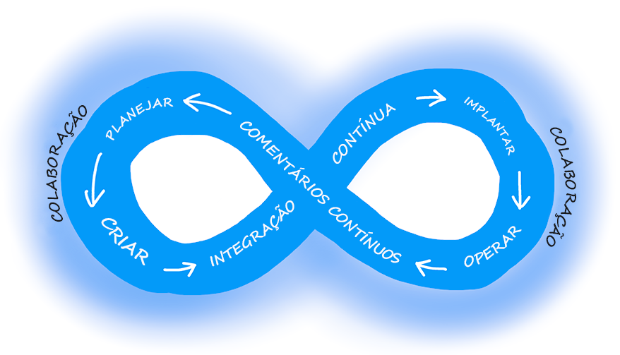
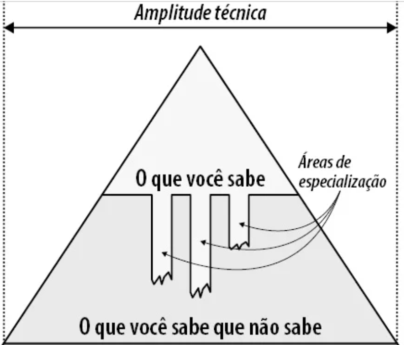

Deivid Matos

https://github.com/DeividMatos1/das-1-2025-2-b

# Aula – 31/07

# Tema: Abstração

A abstração é uma representação simplificada de uma entidade,
permitindo que possamos interagir com ela e tirar proveito de suas funcionalidades
sem a necessidade de compreender todos os seus detalhes internos.
Nas linguagens de programação, a abstração é viabilizada por meio de diversos recursos
clássicos, como classes, interfaces, pacotes e bibliotecas.
Esses instrumentos possibilitam a criação de estruturas mais organizadas,
reutilizáveis e de fácil manutenção, promovendo o desenvolvimento de sistemas
mais eficientes e compreensíveis.

# Tema: complexidade

A complexidade em engenharia de software refere-se à dificuldade de entender,
modificar e manter um sistema à medida que ele cresce. Para lidar com isso,
utilizamos abstrações como classes, interfaces, pacotes e bibliotecas,
que ajudam a organizar o código e tornar o sistema mais compreensível e reutilizável.
Este projeto busca minimizar a complexidade por meio de uma arquitetura modular
e boas práticas de desenvolvimento, facilitando a manutenção e evolução contínua do software.

# Tema: Orientação a objetos

A orientação a objetos (OO) é um paradigma de programação que organiza o software em torno de objetos,
que são instâncias de classes. Cada objeto representa uma entidade do mundo real,
contendo atributos (dados) e métodos (comportamentos).
Esse modelo facilita o desenvolvimento de sistemas mais organizados, reutilizáveis e fáceis de manter,
por meio de quatro pilares principais:

```bash
Abstração: foca nos aspectos essenciais de um objeto, ocultando detalhes desnecessários.
Encapsulamento: protege os dados internos do objeto, permitindo acesso controlado.
Herança: permite que uma classe herde características de outra.
Polimorfismo: possibilita que diferentes objetos respondam de maneira distinta a uma mesma ação.
```

# Tema: Frameworks

Frameworks são estruturas de código reutilizáveis que fornecem uma base para o desenvolvimento de aplicações. Eles oferecem um conjunto de ferramentas, bibliotecas e boas práticas que ajudam a acelerar
o desenvolvimento, padronizar o código e reduzir erros.

Ao utilizar um framework, o desenvolvedor segue uma arquitetura pré-definida, focando mais na lógica do negócio do que na infraestrutura do sistema.

# Aula dia 04/08

# Tema: Desenvolvimento em Paralelo

Esse princípio está ligado à decomposição de problemas. Ao dividir um sistema em módulos ou componentes independentes, diferentes partes podem ser desenvolvidas simultaneamente por equipes distintas. Isso acelera o desenvolvimento e melhora a produtividade. A independência entre os módulos é essencial para evitar conflitos e facilitar a integração posterior.

# Tema: Flexibilidade a Mudanças

Sistemas bem projetados devem ser modulares e de baixo acoplamento, o que facilita alterações em partes específicas sem afetar o restante do sistema. Isso é importante porque mudanças são inevitáveis durante o ciclo de vida do software. Princípios como aberto/fechado (o sistema deve estar aberto para extensão, mas fechado para modificação) ajudam a garantir essa flexibilidade.

# Tema: Facilidade de Entendimento

Um bom projeto deve ser simples e claro, permitindo que outros desenvolvedores compreendam rapidamente o funcionamento do sistema. Isso é alcançado por meio de abstrações bem definidas, nomes significativos, coesão nos módulos e ocultamento de informação (expor apenas o necessário). Quanto mais fácil for entender o sistema, mais fácil será mantê-lo e evoluí-lo.

# Tema: Getter e Setters
Getters e setters são métodos usados para acessar e modificar os atributos (variáveis) de um objeto de forma controlada. Eles fazem parte do princípio de encapsulamento, que visa proteger os dados internos de uma classe e expor apenas o necessário.

# Tema: Coesão
Refere-se ao quanto os elementos de um módulo estão focados em uma única tarefa. Alta coesão torna o código mais fácil de entender, manter e reutilizar.

# Tema: Acoplamento

Acoplamento é o grau de dependência entre módulos ou classes de um sistema. Quanto mais uma classe depende de outra para funcionar, maior o acoplamento. Isso dificulta a manutenção, testes e reutilização do código.

```bash
 "Maximize a coesão das classes e minimize o acoplamento entre elas"
```

# Tema: @Autowired
No Spring Framework, a anotação @Autowired permite a injeção automática de dependências. Ou seja, o Spring cria e fornece os objetos necessários para uma classe, sem que ela precise instanciá-los diretamente.

```bash
"Isso promove o baixo acoplamento, pois:
A classe depende de interfaces ou abstrações, não de implementações concretas.
O controle da criação dos objetos fica com o container do Spring, não com a classe."
```

# Tema: SOLID

O que é SOLID?
SOLID é um conjunto de cinco princípios de design de software orientado a objetos que ajudam a criar sistemas mais flexíveis, compreensíveis e fáceis de manter. Cada letra representa um princípio:

```bash
S – Single Responsibility Principle (Princípio da Responsabilidade Única)
    Uma classe deve ter apenas uma razão para mudar, ou seja, uma única responsabilidade. Isso torna o código mais organizado e fácil de manter.

O – Open/Closed Principle (Princípio Aberto/Fechado)
    O software deve estar aberto para extensão, mas fechado para modificação. Você pode adicionar novas funcionalidades sem alterar o código existente.

L – Liskov Substitution Principle (Princípio da Substituição de Liskov)
    Objetos de uma classe derivada devem poder substituir objetos da classe base sem alterar o comportamento do programa.

I – Interface Segregation Principle (Princípio da Segregação de Interface)
    Uma classe não deve ser forçada a implementar interfaces que não usa. É melhor ter várias interfaces específicas do que uma única interface genérica.

D – Dependency Inversion Principle (Princípio da Inversão de Dependência)
    As classes devem depender de abstrações (interfaces), não de implementações concretas. Isso reduz o acoplamento e aumenta a flexibilidade.
```
# Aula dia 07/08

# Tema Princípio da Responsabilidade Única 

O Princípio da Responsabilidade Única (SRP) afirma que cada classe deve ter apenas uma responsabilidade, ou seja, um único motivo para mudar. Na prática, isso significa separar bem as funções de cada camada da aplicação:

```bash
Entity - representa os dados e regras básicas de negócio, como um modelo de usuário com validações.
Repository - cuida da persistência, sendo responsável por salvar, buscar e atualizar dados no banco.
Service - concentra as regras de negócio mais complexas, coordenando entidades e repositórios.
Controller - recebe as requisições (como de uma API), chama os serviços e retorna as respostas.

# Essa separação torna o código mais organizado, fácil de manter e testar.

```
# Tema Herança

Na programação orientada a objetos e em diagramas UML, a seta de herança representa que uma classe herda de outra, ou seja, ela é um tipo da classe pai. Essa seta é vazada e contínua, apontando da subclasse para a superclasse.

# Tema Associação

A associação indica que uma classe usa ou se relaciona com outra, como quando uma Pessoa tem um Endereco. Essa relação é mostrada com uma linha simples, podendo ter setas para indicar direção e multiplicidade (como 1 ou muitos).

# Tema Interface

Já a interface define um contrato de métodos que uma classe deve implementar. A seta que representa a implementação de uma interface é pontilhada e com ponta vazada, apontando da classe que implementa para a interface.

# Tema Princípio da Segregação de Interfaces

O Princípio da Segregação de Interfaces afirma que uma classe não deve ser forçada a implementar métodos que não utiliza. Ou seja, é melhor ter várias interfaces pequenas e específicas do que uma única interface grande e genérica. Isso evita que classes fiquem sobrecarregadas com responsabilidades que não fazem sentido para elas.

# Aula dia 01/09

# Expectativas de um Arquiteto

```bash
"Tomar decisoes de arquitetura,
Analisar continuamente a arquitetura,
Manter-se atualizado com as ultimas tendências,
Assegurar a conformidade com as decisoes,
Exposicão diversificadas,
Ter conhecimento sobre o dominio do negocio,
Ter habilidades interpessoais, 

Orientacão é a palavra de ordem nessa primeira expectativa,
framework reativo para o desenvolvimento web front-end"
```
# DevOps ∞

> **Função – Entregar valor**

1-Planejar
2-Programar/ criar
3-Integracao continua
4-implantar
5-Operar
6-Comentarios Continuos



"Continuous deployment/delivery"

""Continuous integrations"

# Aula 04/09

# Arquitetura

A arquitetura é como o planejamento da estrutura. É quem decide como tudo vai funcionar por dentro. O arquiteto escolhe as ferramentas, define os caminhos, organiza os componentes e garante que tudo esteja bem conectado e funcionando de forma segura e eficiente.

```bash
Planeja o funcionamento interno.
Escolhe tecnologias e ferramentas.
Lidera tecnicamente o projeto.
```

# Como é a formação do conhecimento de um arquiteto modelo T?

O arquiteto precisa ter um conhecimento em várias áreas, tendo um conhecimento mais amplo, como destacado no livro.

"Como arquiteto, amplitude é mais importante do que profundidade."



"Os arquitetos devem focar a amplitude técnica para que tenham uma aljava maior a partir da qual tiram suas flechas."

# Design

O design cuida da parte visual e da experiência do usuário. Ele pensa em como as coisas vão aparecer na tela, se são fáceis de usar, se estão bonitas e agradáveis. O designer se preocupa com cores, botões, fontes e com a forma como o usuário interage com o sistema.

```bash
"Cuida da aparência e da usabilidade.
Foca na experiência do usuário.
Trabalha com cores, formas e interações.
Torna o uso mais intuitivo e agradável."
```
"Arquitetura pensa na estrutura e funcionamento.
Design pensa na aparência e experiência."
